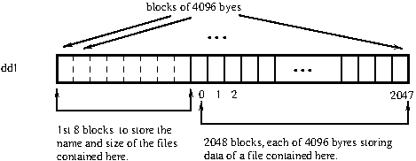

Final Submission to be made today itself!

In previous week's assignment you have used a linux file as a collection of blocks of 4096 bytes. In today's assignment you have store/retrieve/delete multiple linux files into/from such a file (which is viewed as a collection of blocks).

Let the linux file (viewed as collection of blocks) that would store multiple other linux files be dd1.

The following figure depicts how dd1 can be visualised.

dd1

The 1st 8 blocks (8 x 4096 bytes) of dd1 will store the metadata (name and size) of the linux files contained in dd1. Remaining 2048 blocks of dd1 are the data blocks of the contained files. The files contained in dd1 satisfy the following constraints.

Size of each file can at most 4096 bytes requiring 1 block of dd1.
Name of each can have 12 characters at the most.
To store the metedata of every linux file contained in dd1, 16 bytes (12 for the name and 4 for the size). Since each file needs one block, at most 2048 files can be stored in dd1. In the 1st 8 blocks too, metadata of 2048 files can be stored,  that is, (8 x 4096) / 16 = 2048, 

ith ( i = 0...2047)  data block in dd1 corresponds to the ith metada in the 8 metedata blocks.

If the name part in metadata starts with null character, it implies that there is no file there.

You have to implement the following commands.

1. mymkfs dd1 [makes dd1 ready for storing files]
2. mycopyTo <linux file> dd1 [copies a linux file to dd1]
3. mycopyFrom <file name>@dd1 [copies a file from dd1 to a linux file of same name.]
4.  myrm <file name>@dd1 [removes a file from dd1]

Your code should properly indented and documented.